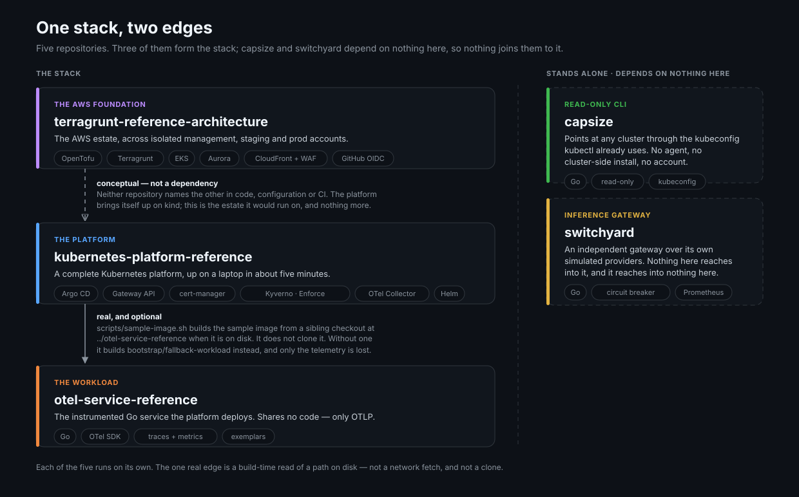

## Paul Bezilla

Infrastructure and platform engineer. Kubernetes, observability, reliability,
and cloud systems.

#### Recent projects

Three of these stack: **otel-service-reference** is the application,
**kubernetes-platform-reference** is the platform it runs on, and
**terragrunt-reference-architecture** is the cloud underneath.

**capsize** and **switchyard** are joined to nothing. capsize is a read-only
Kubernetes CLI that scores cost waste against blast radius. switchyard is an
inference gateway that routes across three simulated providers and fails over
between them. Neither depends on any of the other three.

#### Field Notes

#### [Five checks that proved nothing](https://gist.github.com/bezilla/dff98698cf41129f5d262eb727ef445a)

Building these systems exposed failures their checks missed. Five investigations
into what went wrong, how I found it, and what changed.
